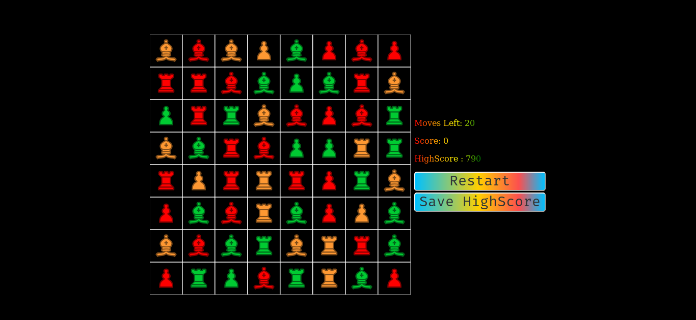

# Match Chess

A match 3 variation with chess pieces and rules(kind of)

## [Play Now](https://lunatichacker.github.io/match-chess/)

## Quick Guide
### Normal Moves
* Same rules as chess but only one square
### Combos
* Match 5 -> Spawns a Queen  
* L/T Shape -> Spawns a Knight
### Using Combos
* Queen -> Move the Queen to any Legal Square and it will Destroy everything in it's path. 
* Kngiht -> Move the Knight to any Legal Square and it will destroy all pieces of that color. 
* Here legal refers to legal move according to Chess rules. 
